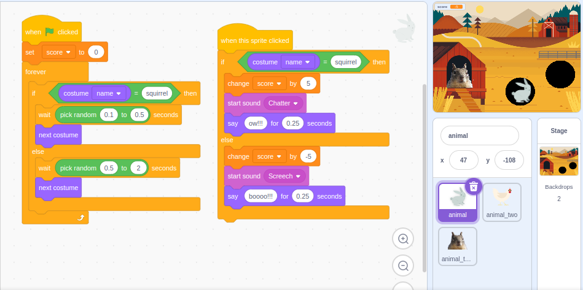
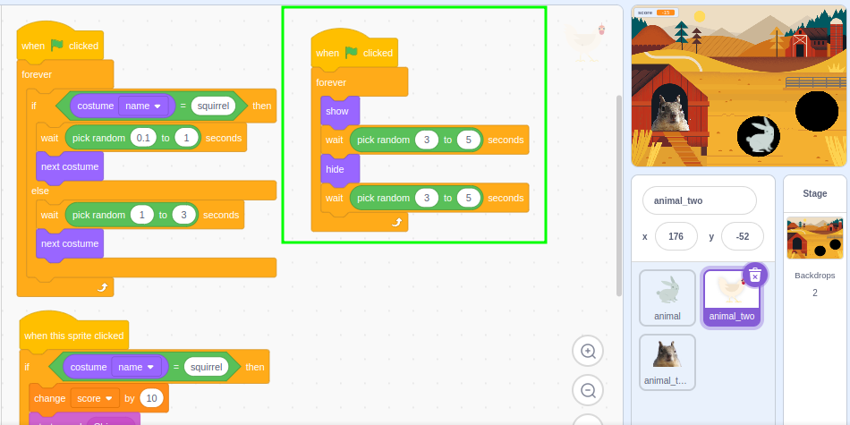
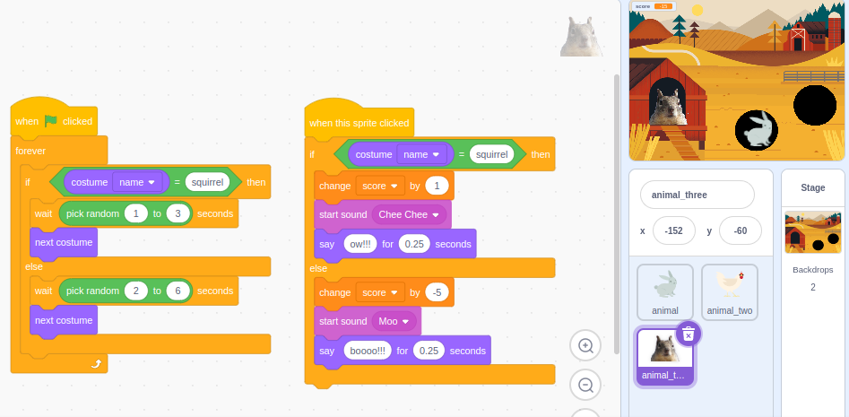

### Lesson 3: Expanding the Game with More If-Else Blocks

#### Objectives
- Add additional if-else blocks to the game.
- Refine the game with more interactions and outcomes based on the sprite's costume.

#### Materials
- Computers with Scratch installed or access to the Scratch website.
- Projector for demonstration.
- Students' game plans and Scratch projects.

#### Lesson Outline
1. **Introduction (15 minutes)**
   - Review if-else blocks | please see [review activities](review-3.md)
   - Watch a live demo of how to develop the simple project | if the teacher is not confident with this then the video in our shared area can be used 😃
   - The developed project can be found @ [whack-a-sprite-developed](https://scratch.mit.edu/projects/1040792890)

2. **Activity 1: Add More If-Else Blocks (30 minutes)**
   - Students implement additional if-else blocks to create more interactions (e.g., if the sprite is wearing costume A, wait X seconds before `next costume`; else, wait Y seconds before `next costume`).
   - Teacher could spend time with less confident programmers in this section with a focus on helping them understand an area they are struggling with - maybe going back over variables so they can succeed at including a variable to control the `score`
   - Teacher could work with the more confident programmers to really push their projects - maybe by adding a timer or other ideas presented in the following images:

3. **Activity 2: Refine and Test the Game (10 minutes)**
   - Students test their games, ensuring all conditions and outcomes work as intended.
   - Provide time for students to add any additional details or polish their projects.

4. **Wrap-Up and Sharing (5 minutes)**
   - Students share their completed games with the class.
   - Reflect on what they learned about using if-else blocks and making interactive games.

#### Differentiation
- **Less Confident:** Focus on solidifying understanding of basic if-else blocks with simple conditions or go back over variables.
- **Average Ability:** Encourage adding at least three if-else blocks and testing thoroughly.
- **More Confident:** Challenge students to create more complex game mechanics with multiple if-else conditions and several interactions as shown in the images above | Challenge the children to add a timer and for a final score to be told to the player

#### Conclusion

By the end of these three lessons, students should have a solid understanding of `if-else` blocks in Scratch along with the concept of how a *condition* determines which part of the block is *executed* | students will have created their own interactive games, applying their new knowledge in a fun and engaging way solving numerous programming problems along the way | practiced working collaboratively and creatively
