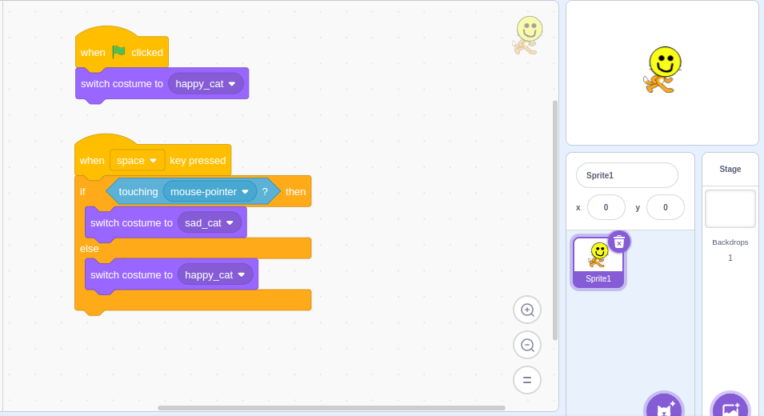

Here's a simple Scratch project that demonstrates the use of if-else blocks in a straightforward way. This project involves a sprite that changes its costume based on user input, emphasizing the concept of if-else statements:

### Scratch Project: Costume Changer

#### Step-by-Step Instructions:

1. **Create Sprite and Costumes:**
   - Start with a sprite such as a cat with at least two costumes (e.g., happy and sad faces).

2. **Coding the Cat Sprite:**
   - Select the cat sprite and go to the Scripts tab.

3. **Setting Up the Script:**
   - Use the following script to control the cat's costume based on keyboard input:

   ```plaintext
   when green flag clicked
   switch costume to "happy"

   when space key pressed
   if <touching [mouse-pointer v]?> then
       switch costume to "sad"
   else
       switch costume to "happy"
   ```

   

   Explanation of the Script:
   - **`when green flag clicked`**: This block starts the script when the green flag is clicked.
   - **`switch costume to "happy"`**: Sets the initial costume of the cat sprite to "happy".
   - **`when space key pressed`**: This block triggers the script when the space key is pressed.
   - **`if <touching [mouse-pointer v]?> then`**: Checks if the cat sprite is touching the mouse pointer.
   - **`switch costume to "sad"`**: Changes the cat's costume to "sad" if it's touching the mouse pointer.
   - **`else`**: If the condition (`touching [mouse-pointer v]`) is not true, it executes the else block.
   - **`switch costume to "happy"`**: Changes the cat's costume back to "happy".

#### Key Concepts Demonstrated:

- **If-Else Statement**: The if-else block (`if ... else ...`) is used to check whether the cat sprite is touching the mouse pointer. If true, it changes to a sad face; otherwise, it remains happy.
  
- **Costume Switching**: Demonstrates how to switch between different costumes based on conditions, reinforcing the concept of if-else logic in a visual and interactive manner.

#### Questions to Check Understanding

Here are some questions you can ask children to check their understanding of if-else statements and the costume changer project in Scratch:

1. **Understanding If-Else Statements:**
   - What is the purpose of using an if-else statement in programming?
   - Explain the difference between an if block and an else block.
   - How does an if-else statement decide which block of code to execute?

2. **Scratch Project Specific Questions:**
   - In the costume changer project, what happens when you click the green flag?
   - Describe the initial costume of the cat sprite when the project starts.
   - What action triggers the cat sprite to change its costume to "sad"?
   - If you press the space key and the cat sprite is touching the mouse pointer, what costume does the cat sprite change to?
   - What costume does the cat sprite change to if you press the space key and it is not touching the mouse pointer?
   - Can you think of another condition that could be used in the if-else statement to change the cat sprite's costume?

These questions are designed to assess children's comprehension of if-else statements and their application in the Scratch costume changer project. Adjust the complexity of questions based on the children's age and familiarity with Scratch programming.
