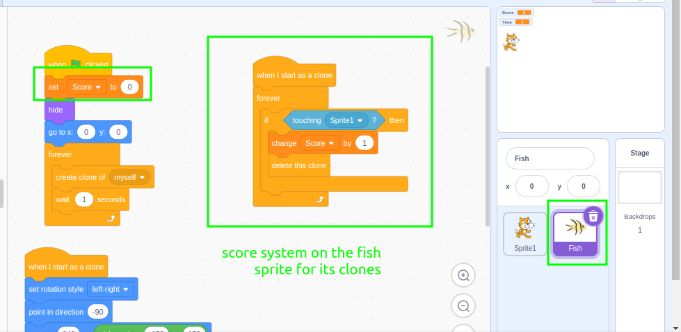

### Lesson Sequence: Creating a Fish Collecting Game in Scratch Using Clones

**Project Overview:** Students will create a game where a cat sprite moves up and down to collect fish sprites that appear as clones moving across the screen. The game will include a timer controlled by a variable, a score system, and different responses based on the fish costumes.

#### Lesson 2: Adding a Timer Using a Variable in a Loop to Govern its Termination

**Objective:** Students will learn to use a variable inside a loop to govern its termination.

**Materials Needed:** Projects from lesson one | screenshots on using variables for timers.

---

**Lesson Plan:**

1. **Introduction and Review (15 minutes):**
   - Review coordinates and cloning using [review activities](review.md).
   - Introduce using variables inside loops to govern the loops termination.
   - If not confident with the above please use the video in the shared area 😃

2. **Activity (40 minutes):**
   - **All Students:**
     - Demonstrate how to create a timer and score system | please use the video in the shared area if not confident 😃
     - Students now create a timer variable and decrement it by 1 every second.
       ```scratch
       when green flag clicked
       set [timer v] to 30
       repeat until <(timer) < 1>
         change [timer v] by -1
         wait 1 second
       end
       ```
     - End the game when the timer reaches 0.
       ```scratch
       when green flag clicked
       set [timer v] to 30
       repeat until <(timer) < 1>
         change [timer v] by -1
         wait 1 second
       end
       stop all
       ```
   - **Differentiation:**
     - **Less Confident Programmers:**
       - Provide screenshots for the score system and timer.
         
         
     - **Average Ability Programmers:**
       - Allow them to tweak the timer duration and or decrements.
     - **More Confident Programmers:**
       - Add more complex features such as having a way to increase time or decrease time | a special fish sprite or costume could be used which increases time and a poisonous sprite or costume could be used to decrease time more.
         

         The screenshots can be found in [images](images)

4. **Review and Sharing (5 minutes):**
   - Share a project and discuss any challenges faced.
