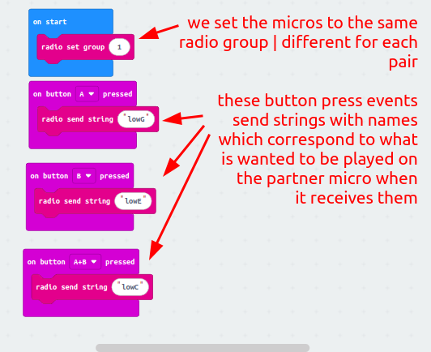
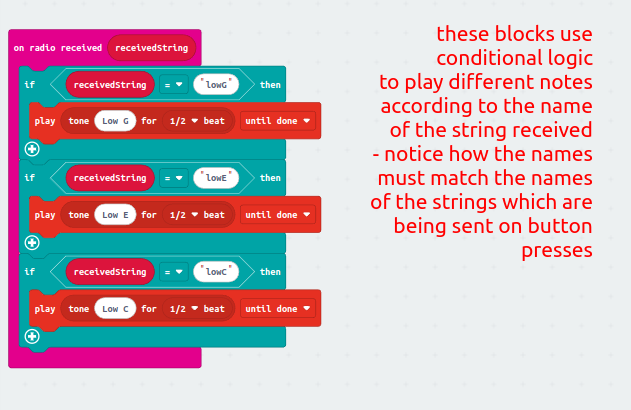
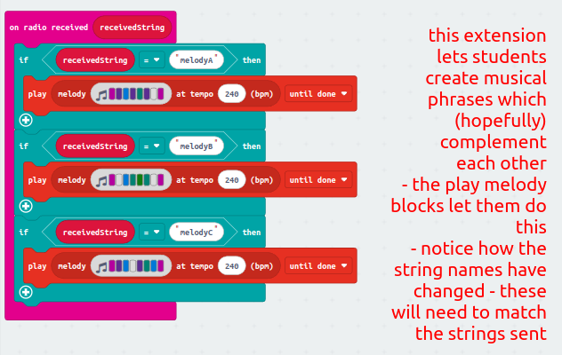

### Lesson Plan: **Duelling Micros** (Call and Response Music)

---

### Learning Objectives:
- Use radio communication to send and receive messages between two micro:bits.
- Create a simple call-and-response musical game where button presses on one micro:bit control sounds on another.
- Differentiate responses using buttons A, B, and A+B, with each button sending a unique message.
- Incorporate conditional logic using if statements.
- Extend for more confident learners by programming melodies instead of single notes.

---

### Lesson Flow:

#### **1. Introduction (10 minutes)**
- **Review Radio Communication:**
  - Briefly recap the use of micro:bit’s radio feature. Explain how each micro:bit can send and receive messages.
  - Demonstrate how a button press on one micro:bit can trigger an event on another micro:bit.
  - An activity from the [radio review activities](https://github.com/zigzaga00/computing-zz00/blob/main/y6/physical-computing/autumn-1/radio-review.md) could be used.
- **Explain the Duelling Micros Idea:**
  - Introduce the idea of a call-and-response game, where each child controls what happens on their partner's micro:bit by pressing buttons | this can be demonstrated with simple call and response claps from the teacher to the class.
  - Explain the concept of three button inputs: Button A, Button B, and A+B.
  - When one child presses a button, it will send a message to their partner’s micro:bit, which will play a corresponding note | the children are sending a musical phrase which their partner hears on their own micro before responding back with their own phrase.

>[!NOTE]
>Introduce Vocabulary in the Introduction
  - **Packet:** Describe how data is sent in small chunks called packets, allowing for efficient communication - refer back to how the internet works.
  - **Radio Frequency:** Introduce the idea that micro:bits use specific radio frequencies to send and receive these packets - light wavelength could be used as an analogy here.

#### **2. Main Activity (45 minutes)**

>[!IMPORTANT]
>Each pair will need to be given a specific radio group number to use to prevent interference from other pairs | numbers 0 to 255 can be used

**a. Basic Code Explanation and Setup (10 minutes)**
- **For Both Micro:bits (Transmitting and Receiving):**
  1. Set both micro:bits to the same radio group.
  2. Program Button A to send the string "note1," Button B to send "note2," and A+B to send "note3."
  3. Write code on the partner’s micro:bit to play different notes when "note1," "note2," or "note3" are received.

  Example code:

>[!NOTE]
>If not feeling confident demonstrating this please use the video in our shared area :smiley: 

**b. Pair Work (35 minutes)**
- **Children work in pairs:**
  - One micro:bit sends the messages.
  - The other receives and plays the notes.

- **Challenge:**
  - Let children experiment with different sequences of button presses to create their own musical "call and response."

**c. Differentiation:**

- **Less Confident Learners:**
  - Focus on sending simple, single button presses (A, B, A+B) and hearing the corresponding notes.
  - Experiment with timing between presses to create rhythm.

- **Average Learners:**
  - Try pressing buttons in different orders and speeds to create rhythmic patterns.
  - Implement the idea of a "turn-taking" game, where each child listens to their partner’s phrase and responds with a phrase of their own.

- **More Confident Learners:**
  - Instead of playing single notes, program the receiving micro:bit to play short melodies when it receives each message.
  - Extend with loops or complex melodies for each received string.

#### **4. Conclusion (5 minutes)**
- **Discussion Points:**
  - Highlight how the micro:bits are a part of a **system** that includes both hardware (the micro:bit devices) and software (the code written in MakeCode).
  - Discuss how the interaction between the micro:bits exemplifies a **communication protocol**, which governs how they send and interpret messages.

---

### Differentiation:
- **Less Confident:**
  - Focus on understanding button inputs and playing single notes.
  - Get the children to use the video and pause it as they build alongside it.

- **Average:**
  - Encourage creativity in button sequences to create rhythmic patterns.
  - Support the timing aspect and the turn-taking game.

- **More Confident:**
  - Push for the creation of melodies instead of single notes.
  - Introduce loops and built-in melodies, challenging them to expand on the basic framework.

---

This project combines creative thinking with technical coding, giving students the opportunity to work together and enhance their collaboration skills while experimenting with musical ideas!
